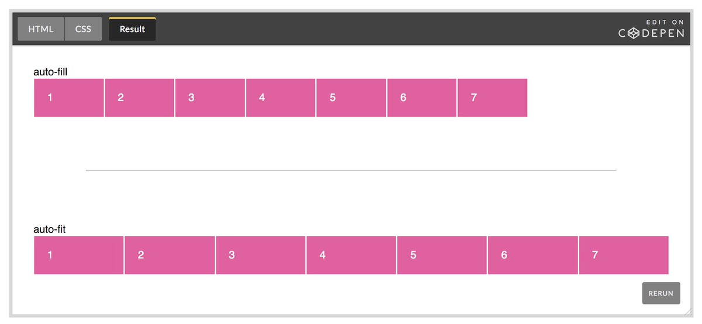

# CSS Grid's `auto-fill` vs `auto-fit`

`auto-fill` _fills_ the row with as many columns as possible, even if there is no content to put in those columns.
`auto-fit` _fits_ the current content into as many rows as needed.

In practice, this means `auto-fill` will create empty columns, `auto-fit` makes stretchy columns.

[[css]]