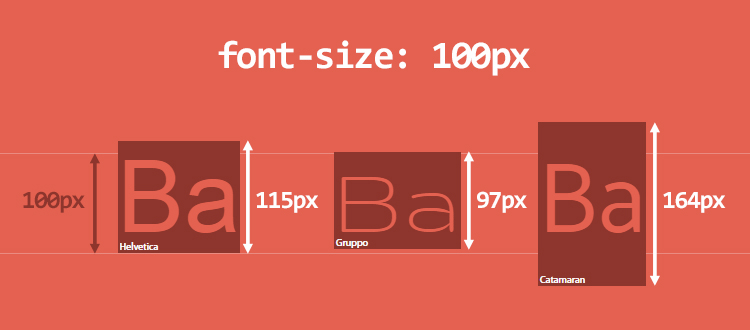

# Unpacking line-height in CSS

`line-height` is more complicated than it initially appears, and they have more scope than you think. Line height is used to calculate the **inline formatting context**, which exists for more than just text.

> On block-level elements, it specifies the minimum height of line boxes within the element. On non-replaced inline elements, it specifies the height that is used to calculate line box height.

By default, the `line-height` is set to `normal`. Which is usually around 1.2, but it depends on the font!

**Creating some text with `font-size: 100px` doesn't create elements with 100px height**, as shown below. It's dependent on the font, which defines its 'em-square' (a container where each character will be drawn in). It's usually 1000 units, but can be any value. A font also has relative units as part of its metrics (e.g. ascender, descender, x-height, etc.) which are scaled to fit the desired font size.

For Catamaran listed above, the em-square is 1000, the ascender 1100, and the descender 540. 1100+540 = 1640 = 164px when setting `font-size: 100px`. **This computed height defines the _content area_ of an element**, referring to the CSS box model.

TODO - line boxes
[[20210806121648-line-boxes-css]]

- Height of box rendered ≠ font-size * line-height
    - I think this is actually based on the font again?
- Text is placed in the middle of the line-box
    - Also applies to inline-block elements
    - and inline-*?
- Leading is what typesetters used in the older days, strips of lead placed below the letters. (add this to leading-trim doc?)
    - CSS introduced 'half-leading', which applied half that leading on either side of the element. Places it in the middle on the line-box
        - Various reasons, namely to make things 'appear' vertically centred
- More info on inline- and inline-block elements
    - empty inline-block element has a height based on its (parent?) line-height
    - inline elements only gain this height once they have content in them
- Struts?

https://drafts.csswg.org/css-inline/#inline-height
https://iamvdo.me/en/blog/css-font-metrics-line-height-and-vertical-align
https://meyerweb.com/eric/css/inline-format.html
https://css-tricks.com/how-to-tame-line-height-in-css/
https://stackoverflow.com/questions/27536428/inline-block-element-height-issue
https://stackoverflow.com/questions/20106428/why-does-inline-block-cause-this-div-to-have-height/20107222#20107222

[[20210806114625-typography-anatomy]]
[[20210806120022-leading-trim-css]]

#css
#typography