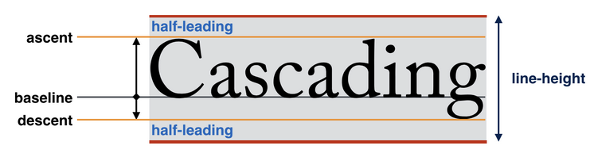

# Anatomy of Typography

CSS uses 'half-leading', which is where most of the woes of line-height come from. This adds space before and after the font, which is useful for vertically centering the text within its linebox, but makes it harder to achieve pixel perfect designs when introducing padding, layout components, etc.

[[20210806120022-leading-trim-css]]

#css
#typography