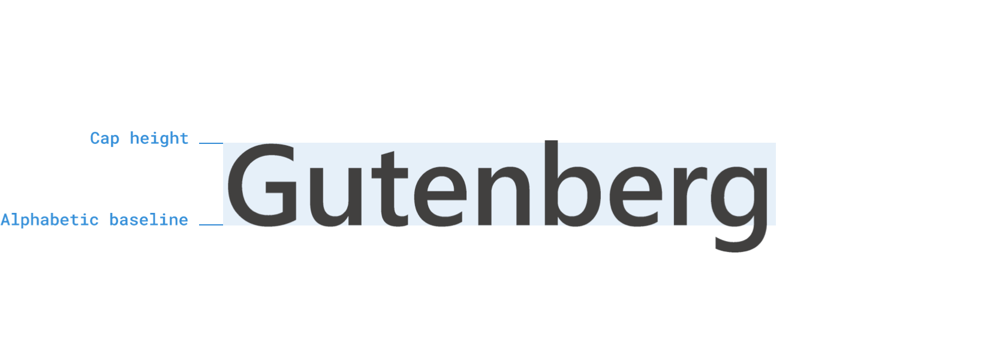

# `leading-trim` in CSS

This is the native solution to what [Capsize](https://seek-oss.github.io/capsize/) aims to achieve.
It's part of the _CSS Inline Layout Module Level 3_, and allows you to control the half-leading for better better visual alignment pf text.

https://github.com/w3c/csswg-drafts/issues/3240
https://medium.com/microsoft-design/leading-trim-the-future-of-digital-typesetting-d082d84b202

#css
#typography